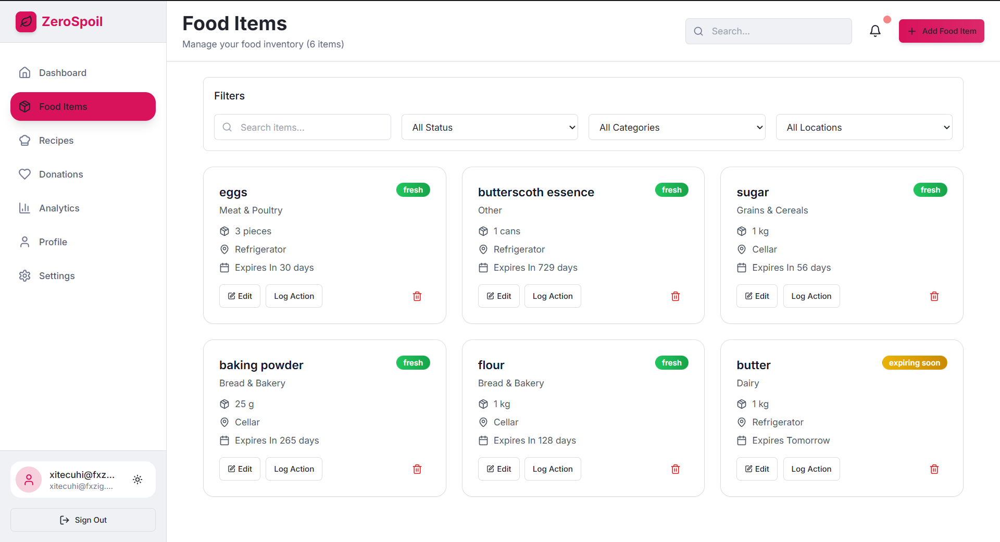

# ZeroSpoil - Smart Food Waste Management Platform

<p align="center">
  
</p>

<p align="center">
  <a href="https://nextjs.org/"></a>
  <a href="https://www.typescriptlang.org/"></a>
  <a href="https://supabase.io/"></a>
  <a href="LICENSE"></a>
</p>

<p align="center">
  <strong>Reduce food waste with AI-powered expiration predictions, smart recipe suggestions, and local donation connections.</strong>
</p>

<p align="center">
  <a href="#-features">Features</a> •
  <a href="#-tech-stack">Tech Stack</a> •
  <a href="#-getting-started">Getting Started</a> •
  <a href="#-project-structure">Structure</a> •
  <a href="#-contributing">Contributing</a>
</p>

---

ZeroSpoil is a comprehensive food waste management platform built with modern web technologies. It helps users track food inventory, predict expiration dates using AI, generate recipes from available ingredients, and connect with local donation networks to reduce food waste.

## 🌟 Key Features

### 🍽️ Food Inventory Management
- Track food items with purchase dates, expiration dates, and storage locations
- Categorize items for better organization
- Add photos to visually identify items
- Real-time status updates (fresh, expiring soon, expired)
- Search and filter capabilities

### 🤖 AI-Powered Expiration Prediction
- Smart algorithms predict food expiration dates based on storage conditions
- Confidence scoring for predictions
- Storage tips for extending freshness
- Automatic status updates based on expiration dates
- Machine learning models for improved accuracy over time

### 👨‍🍳 Intelligent Recipe Suggestions
- AI-generated recipes using available ingredients
- Personalized suggestions based on dietary restrictions and preferences
- Detailed cooking instructions with prep/cook times
- Nutritional information and chef tips
- Cuisine-specific recommendations
- Difficulty level filtering

### 📊 Waste Tracking & Analytics
- Comprehensive analytics dashboard
- Waste reduction metrics and environmental impact tracking
- Cost savings calculations
- Category-based insights and trends
- Historical data visualization
- CO₂ emissions prevented tracking

### ❤️ Local Donation Network
- Connect with nearby food banks and shelters
- Schedule food donations with ease
- Track donation history and impact
- Pre-populated local donation locations
- Donation impact metrics

### 👤 User Profiles & Preferences
- Customizable dietary restrictions and preferences
- Notification settings for expiration alerts
- Theme preferences (light/dark mode)
- Business account options for commercial use
- Measurement system preferences (metric/imperial)

## 🛠️ Tech Stack

### Frontend
- **Framework**: [Next.js 14](https://nextjs.org/) with App Router
- **Language**: [TypeScript](https://www.typescriptlang.org/)
- **Styling**: [Tailwind CSS](https://tailwindcss.com/) with custom animations
- **UI Components**: Custom component library with [Framer Motion](https://www.framer.com/motion/) for animations
- **State Management**: React Context API and custom hooks
- **Forms**: [React Hook Form](https://react-hook-form.com/) with [Zod](https://zod.dev/) validation
- **Icons**: [Lucide React](https://lucide.dev/)

### Backend
- **API**: Next.js API Routes
- **Database**: [Supabase](https://supabase.io/) (PostgreSQL)
- **Authentication**: Supabase Auth with email/password and OAuth
- **Real-time**: Supabase Real-time subscriptions
- **Storage**: Supabase Storage for image uploads

### AI & External Services
- **AI Generation**: [Google Gemini API](https://ai.google.dev/) for recipe suggestions and expiration predictions
- **Maps**: Integration-ready for donation location mapping
- **Analytics**: Custom analytics engine with waste tracking

### Development Tools
- **Package Manager**: npm
- **Linting**: ESLint with Next.js plugin
- **Formatting**: Prettier
- **Testing**: Jest and React Testing Library (planned)
- **Deployment**: Vercel (recommended)

## 🚀 Getting Started

### Prerequisites
- Node.js 18+
- npm or yarn
- Supabase account
- Google Gemini API key (for AI features)

### Installation

1. Clone the repository:
```bash
git clone https://github.com/iamdheerajjain/zerospoil.git
cd zerospoil
```

2. Install dependencies:
```bash
npm install
```

3. Set up environment variables:
```bash
cp .env.local.example .env.local
```

Fill in your environment variables in `.env.local`:
```env
NEXT_PUBLIC_SUPABASE_URL=your_supabase_url
NEXT_PUBLIC_SUPABASE_ANON_KEY=your_supabase_anon_key
SUPABASE_SERVICE_ROLE_KEY=your_supabase_service_role_key
GEMINI_API_KEY=your_gemini_api_key
```

4. Set up the database:

Run the SQL schema in `lib/database.sql` in your Supabase SQL editor to create all necessary tables and set up Row Level Security policies.

5. Run the development server:
```bash
npm run dev
```

Open [http://localhost:3000](http://localhost:3000) to see the application.

### Building for Production

```bash
npm run build
npm start
```

## 🤖 AI Features

### Recipe Generation
The application leverages Google Gemini API to generate creative recipes based on:
- Available ingredients
- Dietary restrictions
- Cuisine preferences
- Cooking time constraints
- Difficulty levels
- Health goals

### Expiration Prediction
AI-powered expiration date prediction considers:
- Food type and category
- Storage conditions
- Purchase date
- Environmental factors
- Historical data patterns

## 📊 Analytics & Reporting

The analytics dashboard provides insights into:
- Total items tracked
- Items expiring soon
- Money saved from waste reduction
- CO₂ emissions prevented
- Waste trends over time
- Category breakdowns
- Action distribution (consumed, donated, wasted)
- Weekly and monthly summaries

## 📱 Progressive Web App (PWA)

ZeroSpoil is PWA-ready with:
- Offline support
- Installable on mobile devices
- Push notifications (planned)
- Fast loading with service workers
- Mobile-first responsive design

## 🧪 Testing

The project includes:
- Unit tests with Jest
- Component tests with React Testing Library
- End-to-end tests with Cypress (planned)
- Integration tests for API routes

Run tests with:
```bash
npm test
```
## Sample Results




